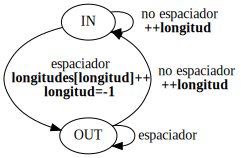

# TP N.° 2 — Máquinas de Estado — Histograma de longitud de palabras

## 1. Arboles de Expresión

### 1.b) Arbol de expresión de: nl = nw = nc = 0


### 1.c) Arbol de expresión de: c == ' ' || c == '\n' || c == '\t'


## 2. Máquina de Estado

### 2.a)


### 2.b)
M = (Q, &#x3A3;, T, q0, F) Con:
* Q = {IN, OUT}
* &#x3A3; = ASCII
* T = { OUT => no espaciador => IN, OUT => espaciador => OUT, IN => espaciador => OUT, IN => no espaciador => IN }
* q0 = OUT
* F = {IN, OUT}

TT
| T | no espaciador | espaciador |
|---|---------------|------------|
|OUT&plusmn;| IN | OUT |
| IN+ | IN | OUT |


## 3. Implementaciones de Máquinas de Estado
### a - Implementacion Switch y Enum.
#### ii)  Indicar ventajas y desventajas de la versión de [KR1988] y de esta implementación.

Algunas **ventajas** de utilizar switch respecto de if-else son:
* El código es más legible, ya que la estructura switch permite agrupar los casos para cada estado, lo que lo hace más fácil de entender.
* El código es menos propenso a errores por la agrupación de los casos.
* Es más mantenible en caso de querer agregar más estados o realizar algún cambio.

Algunas **desventajas** de utilizar switch son:
* No es tan legible como si se usara un if, el switch se usa cuando hay muchas ramas.

### b - Implementación GoTo
#### iv) ¿Tiene alguna aplicación go to hoy en día? ¿Algún lenguaje moderno lo utiliza?
* Goto esta presente en Golang.
* La sentencia **_goto_** es considerada una práctica de programación obsoleta y generalmente se evita en el desarrollo de software moderno ya que el uso excesivo de **_goto_** puede llevar a un código difícil de entender, mantener y depurar, debido a estructuras de control confusas o saltos no controlados.

### c - Implementacion Recursiva

#### ii) ¿Es necesario que las funciones accedan a contadores? Si es así, ¿cómo hacerlo?
No es necesario.
Si fuera necesario, una forma seria pasar un pointer al contador como argumento.

### d - Implementacion OOP
Hay 3 objectos:
* Encargado de leer la entrada de texto.
* Encargado de decidir cual es el estado actual.
* Encargado contar la longitud de las palabras.
Cada objecto maneja su propio estado y presenta una interfaz usada para la comunicacion entre ellos.  
Tambien se uso composicion.
Los estados estan representados por un enum, IN y OUT.
Las transiciones estan representadas con una variable que guarda el estado anterior.

## 12.4 Restricciones
La implementacion puede seleccionarse en ejecucion mediante una DLL

## Credito extra
La parametrizacion del modo de dibujo del histograma (Vertical u Horizontal) se realiza con un argumento al ejecutar el programa. 'H' para Horizontal y 'V' para vertical.

## Tests de performance
Se creo el programa test.c que ejecuta la dll del histograma y mide el tiempo imprimiendo la duracion de la ejecucion en salida estandar.  
El makeFile contiene un target que ejecuta este programa con cada implementacion reemplazando la dll y agrega la salida a un archivo.
### Resultados:  
```
Ejecucion con input 5248950 bytes
--------------------------------------------
Creando Histograma con enum switch
Duracion de la ejecucion: 0.42026000 s.
Creando Histograma con goto
Duracion de la ejecucion: 0.38877200 s.
Creando Histograma con objetos
Duracion de la ejecucion: **0.32034800** s.

Ejecucion con input 5136 bytes
--------------------------------------------
Creando Histograma con enum switch
Duracion de la ejecucion: 0.299500 s.
Creando Histograma con goto
Duracion de la ejecucion: 0.252700 s.
Creando Histograma con recursion
Duracion de la ejecucion: **0.1362600** s.
Creando Histograma con objetos
Duracion de la ejecucion: 0.260000 s.

Ejecucion con input 1099784999 bytes
--------------------------------------------
Creando Histograma con enum switch
Duracion de la ejecucion: 9.729585900 s.
Creando Histograma con goto
Duracion de la ejecucion: 9.470248300 s.
Creando Histograma con objetos
Duracion de la ejecucion: **7.929466600** s.
```
Se puede observar que la implementacion por objetos es superior en performance.  
La implementacion por recursion produjo un error "segmentation fault" con los archivos de 5Mb y 1G debido a que el stack crecio demaciado.
